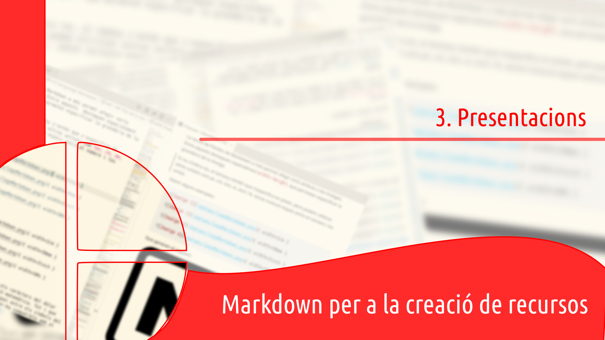
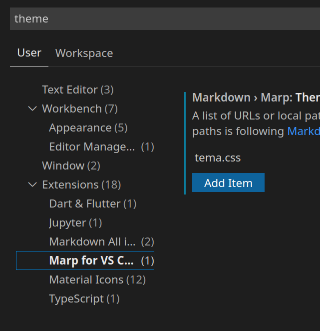
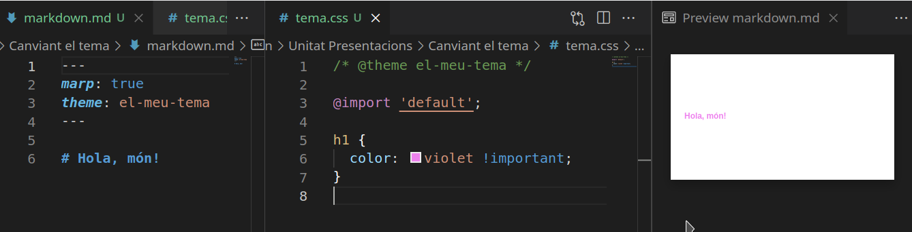

<!--
_header: ''
_footer: ''
-->
---
# Canviant el tema CSS

## Si volem canviar el tema CSS, estos són els passos que hauriem de seguir.

---
1. Creem una carpeta i la obrim amb VSCode.
2. Posem l'arxiu CSS en eixa carpeta.
    1. Anem a suposar que és ***tema.css***, que volem que el tema es diga ***el-meu-tema*** i que volem heredar del tema *default*. 
    2. Afegim les regles que ens interesse, en este cas redefinim el color dels encapçalaments de nivell 1. Quedaria així:
```css
/* @theme el-meu-tema */

@import 'default';

h1 {
  color: violet !important;
}
```

---
3. Ves a File -> Preferences -> Settings. 
   1. Busca "Themes" i ves a l'apartat Markdown > Marp: Themes. 
   2. En "Add Item" posa la ruta relativa al tema, *tema.css*. Fixa't que ha de ser relativa a la carpeta que hem obert al Visual Studio Code. Tens l'opció de fer clic amb el botó dret al fitxer CSS i copiar la ruta relativa al porta-retalls.
   3. Ara ja pots utilitzar "el-meu-tema" com a tema en el markdown simplement posant *theme: el-meu-tema* al front-matter.
  

---
4. Creem l'arxiu de presentació i configurem *el-meu-tema* com a tema de la presentaió.

```yaml
---
marp: true
theme: el-meu-tema
---

# Hola, món!
```

---
5. Previsualitzem la presentació i ja deuriem veure les regles aplicades:




6. Comprova que "Hola, món!" està en color morat i que canvia de color al canviar la regla.

---
Si eres dels que prefereix la línia de comandaments i utilitza el marp-cli, tens l'opció d'utilitzar l'opció --theme-set per a canviar el tema. Per a generar la presentació de l'exemple anterior amb el tema que hem creat, l'ordre seria la següent (amb el directori de treball situat a la carpeta que hem creat en el punt 1):

```bash
marp markdown.md --theme-set tema.css
```