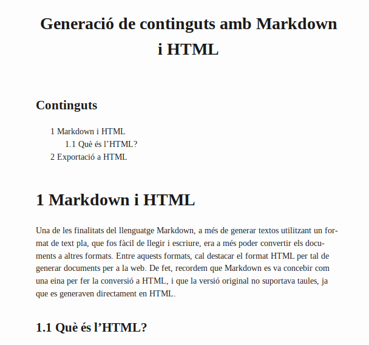
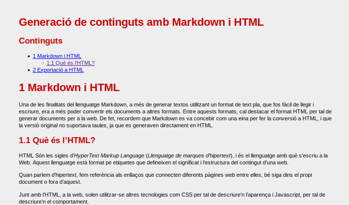
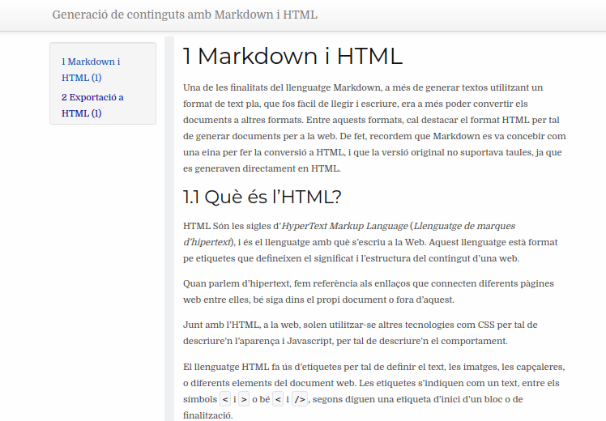

---
# Informació general del document
title: Generació de continguts amb Markdown i HTML
lang: ca
# page-background: img/bg.png

# Portada
titlepage: true
titlepage-rule-height: 2
titlepage-rule-color: AA0000
titlepage-text-color: AA0000
titlepage-background: img/portada.png

# Taula de continguts
toc: true
toc-own-page: true
toc-title: Continguts

# Capçaleres i peus
header-left: 4. Markdown i HTML
header-right: Curs 2021-2022
footer-left: CEFIRE València
footer-right: \thepage/\pageref{LastPage}

# Llistats de codi
listings-no-page-break: false
listings-disable-line-numbers: false

header-includes:
   - \usepackage{lastpage}
---


# Markdown i HTML

Una de les finalitats del llenguatge Markdown, a més de generar textos utilitzant un format de text pla, que fos fàcil de llegir i escriure, era a més poder convertir els documents a altres formats. Entre aquests formats, cal destacar el format HTML per tal de generar documents per a la web. De fet, recordem que Markdown es va concebir com una eina per fer la conversió a HTML, i que la versió original no suportava taules, ja que es generaven directament en HTML.

## Què és l'HTML?

HTML Són les sigles d'*HyperText Markup Language* (*Llenguatge de marques d'hipertext*), i és el llenguatge amb què s'escriu a la Web. Aquest llenguatge està format pe etiquetes que defineixen el significat i l'estructura del contingut d'una web.

Quan parlem d'hipertext, fem referència als enllaços que connecten diferents pàgines web entre elles, bé siga dins el propi document o fora d'aquest.

Junt amb l'HTML, a la web, solen utilitzar-se altres tecnologies com CSS per tal de descriure'n l'aparença i Javascript, per tal de descriure'n el comportament.

El llenguatge HTML fa ús d'etiquetes per tal de definir el text, les imatges, les capçaleres, o diferents elements del document web. Les etiquetes s'indiquen com un text, entre els símbols `<` i `>` o bé `<` i `/>`, segons diguen una etiqueta d'inici d'un bloc o de finalització.

En general i de manera simplificada, un document web seguirà aquest esquema (els textos entre `<!--` i `-->` són comentaris, i no són interpretats pel navegador web):

```html
<html> <!-- aquesta etiqueta indica l'inici del document html -->
    <head> <!-- Capçalera amb informació sobre el document: títol, codificacions, etc.-->
        <title>
          <!-- Avi va el títol que veiem a la barra del navegador, no l'hem 
               de confondre amb el títol (# o h1) que veiem al document -->
        </title>
      ...
   </head> <!-- Etiqueta de finalització de la capçalera-->

   <body> <!-- Amb aquesta etiqueta indiquem l'inici del cos de la pàgina -->
      ...
   </body> <!-- Fi del cos de la pàgina -->
<html>
```

# Exportació a HTML

Recordem com convertíem fent ús de Pandoc un document Markdown a HTML:

```bash
pandoc fitxerEntrada.md -o fitxerEixida.html
```

De manera predeterminada, `pandoc` produïa un fragment de document, no un document complet, és a dir, una secció que aniría dins el *body* d'una pàgina web. Si el que volem és generar un fitxer HTML complet, que serà el més habitual, amb el `<head>` i `<body>` caldrà utilitzar l'opció `--standalone`, o de forma reduïda `-s`:

```bash
$ pandoc fitxerEntrada.md -o fitxerEixida.html -s
```

Aquesta ordre, si no teníem definit un `title` al bloc de metadades del document, ens generarà l'advertència:

```bash
[WARNING] This document format requires a nonempty <title> element.
  Defaulting to 'fitxerEntrada' as the title.
  To specify a title, use 'title' in metadata or --metadata title="...".
```

Si no tenim un títol, podíem indicar aquest de la següent manera:

```bash
pandoc fitxerEntrada.md -o fitxerEixida.html -s --metadata title="Pàgina de prova"
```

A més, recordeu que també podíem especificar el format d'eixida amb `-t html`, si no havíem indicat l'extensió al fitxer d'eixida.

## Afegint estils

Ara generarem un document (per exemple aquest) en format HTML amb l'ordre anterior, i afegint també un índex als continguts, amb l'ordre següent:

``` bash
pandoc 1.MarkdownIHtml.md -o 1.MarkdownIHtml.html -s --toc --number-sections
```

El resultat és el següent:

{ width=10cm }

Com veiem, té un disseny molt semblant a un document LaTeX en PDF, però en format web. Aquest disseny, el podem modificar afegint un full d'estils (CSS) on s'indique el format que desitgem per als diferents elements, tal i com vam veure al tema de MARP. 

Per exemple, si ara creem un document anomenat `el-meu-estil.css` a la carpeta on es troba el nostre document, amb el següent contingut:

```css
body {
    /*Canviem les propietats del cos: la lletra, el color de fons i els marges*/
    font-family: 'Trebuchet MS', 'Lucida Sans Unicode', 'Lucida Grande', 'Lucida Sans', Arial, sans-serif;
    background-color: #eeeeee;
    margin: 100px;
}

h1,
h2 {
   /*Canviem el color d eles capçaleres de 1r o 2n nivell*/
    color: #cc0000;
}
```

Podem fer ús de l'opció `-c el-meu-estil.css` per indicar que utilitze estos estils, de la següent manera:

``` bash
pandoc 1.MarkdownIHtml.md -o 1.MarkdownIHtml.html -s --toc --number-sections -c el-meu-estil.css
```

Amb això generarem el document:

{ width=10cm }

## Modificant la plantilla

Un altre aspecte que podem modificar és la plantilla, com a tal del document. D'aquesta manera, podem indicar quins elements es mostren, quins no i quin és el seu disseny.

Una manera interessant de començar a crear una plantilla seria partint de la pròpia plantilla que utilitza Pandoc. Per tal d'obtenir aquesta plantilla fem ús de l'ordre:

```
pandoc -D html > plantilla.html
```

Amb això, *extraiem* la plantilla per defecte que utilitza Pandoc, i la guardem en un fitxer HTML. Si fem un cop d'ull a aquest fitxer, veurem codi semblant al següent (mostrem un fragment):

```html
$if(title)$
<header id="title-block-header">
<h1 class="title">$title$</h1>
$if(subtitle)$
<p class="subtitle">$subtitle$</p>
$endif$
$for(author)$
<p class="author">$author$</p>
$endfor$
$if(date)$
<p class="date">$date$</p>
$endif$
</header>
$endif$
```

Si esteu familiaritzats amb el codi HTML, us sonaran algunes d'aquestes etiquetes, com les diferents capçaleres `h1`, els paràgrafs `<p>`, etc. Els textos que hi ha entre els símbols del `$`, són ordres en referència a la informació que contindrà el nostre document Markdown, com per exemple el títol, (*title*), subtítol (*subtitle*), autors, etc. Amb aquestes *instruccions*, el que fa és, segons el contingut que tinga el nostre document, genera unes parts o altres del document HTML final.

Per exemple, si volem que no apareguen els autors en el document, podríem esborrar el fragment:

```html
$for(author)$
<p class="author">$author$</p>
$endfor$
```

Si teniu coneixements d'HTML, podreu modificar i fins i tot canviar l'estructura d'aquesta plantilla al vostre gust. 

Per altra banda, de la mateixa manera que hem utilitzat una plantilla de la xarxa com Eisvogel per a la conversió a PDF, podem utilitzar també plantilles existents a Internet. Per exemple, al repositori [https://github.com/ryangrose/easy-pandoc-templates](https://github.com/ryangrose/easy-pandoc-templates) podem trobar diverses plantilles per a l'exportació a diferents formats, entre ells HTML.

:::warning
Si feu ús de les plantilles HTML d'Easy Pandoc Templates, cal que feu una xicoteta modificació per tal que funcionen correctament amb Pandoc. 

Una vegada es desarregueu el fitxer HTML de la plantilla, caldrà que busqueu el text `$toc$` i el reemplaceu per `$table-of-contents$`, per tal de veure correctament l'índex de continguts al menú.
:::

Anem a utilitzar, per exemple la plantilla `elegant_bootstrap_menu.html`, d'aquest repositori. 

Una vegada modificat el `$toc$` per `·table-of-contents$`, generem el nostre document amb:

```bash
pandoc 1.MarkdownIHtml.md -o 1.MarkdownIHtml.html -s --number-sections --template bootstrap-menu.html --toc
```

I obtindrem el següent resultat:

{ width=10cm }

# Generadors de llocs web estàtics

Fins ara hem vist com crear documents HTML complets a partir de documents amb Markdown. Si ens adonem, aquests documents són pàgines simples, que no estan enllaçades a cap altre document. 

Aleshores, com podríem generar un conjunt de pàgines i enllaçar-les amb elles per tindre un lloc web complet?

La resposta són un tipus d'aplicacions que es coneixen com a generadors de llocs web estàtics.

A grans trets, un lloc web, a l'hora de servir els seus continguts, pot fer-ho de dues formes: de manera dinàmica o de manera estàtica.

La generació dinàmica de continguts es produeix quan, per servir contingut web, aquest es genera de forma automàtica, consultant, per exemple una base de dades. Aquest és el cas de molts gestors de continguts actuals, com puga ser Wordpress (portalEdu), Joomla, o la plataforma Moodle. Aquests llocs, el principal inconvenient que tenen és que necessiten una quantitat important de recursos, i el processament d'una petició sol ser més costós (ja que ha de consultar bases de dades, fitxers, altres servidors, i finalment, produir el document). L'avantatge, és evident, i és que la informació que ofereixen és molt més dinàmica i actualitzable.

Per altra banda, un generador de llocs estàtics senzillament *genera* els documents HTML i els prepara per ser servits. Té l'avantatge que la càrrega de continguts és molt més ràpida, però cal generar el lloc cada vegada que afegim un nou contingut. Aquestes característiques els fan apropiats per a sistemes de documentació, com per exemple, els nostres apunts, ja que no requereixen d'una actualització excessivament constant.

Als pròxims apartats veurem dos d'aquests gestors: Jekyll i Hugo.


