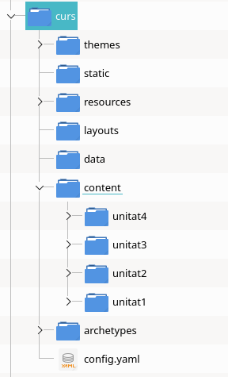

---
# Informació general del document
title: Llocs estàtics amb Hugo
lang: ca

# Portada
titlepage: true
titlepage-rule-height: 2
titlepage-rule-color: AA0000
titlepage-text-color: AA0000
titlepage-background: img/portada.png

# Taula de continguts
toc: true
toc-own-page: true
toc-title: Continguts

# Capçaleres i peus
header-left: 4. Markdown i HTML
header-right: Curs 2021-2022
footer-left: CEFIRE València
footer-right: \thepage/\pageref{LastPage}

# Llistats de codi
listings-no-page-break: false
listings-disable-line-numbers: false

header-includes:
   - \usepackage{lastpage}

summary: Hugo és un dels generadors de llocs web estàtics de codi lliure més utilitzats.  Aquests generadors són eines que creen llocs web complets a partir de determinats fitxers de configuració i contingut. En aquesta entrada veurem com descarregar l'eina Hugo i crear un lloc nou.
draft: false
#image: /post_imgs/1.creacio.md.svg
---

# Hugo, un generador de llocs web estàtics

Hugo és un dels generadors de llocs web estàtics de codi lliure més utilitzats, i que ens genera un lloc web complet a partir de documents Markdown i fitxers de configuració.

# Instal·lació d'Hugo

A la web [https://gohugo.io/getting-started/installing/] s'especifiquen diversos mètodes d'instal·lació per a diferents sistemes operatius.

La manera d'instal·lar la versió és recent d'Hugo en sistemes basats en Ubuntu com LliureX és a través de l'eina `snap`. Per a això, executaríem com a administradors del sistema:

```
$sudo snap install hugo --channel=extended
```

Amb açò ja podem comprovar la versió que tenim instal·lada des de la línia d'ordres:

```
$ hugo version
hugo v0.88.1+extended linux/amd64 BuildDate=2021-09-04T13:52:13Z
```

:::warning
Comproveu que teniu la versió `+extended`, per tal de poder treballar bé amb les plantilles.
:::


# Creació de continguts amb Hugo

Per tal de crear un lloc web des de zero, utilitzarem l'ordre `new site`, de la següent manera:

```bash
$ hugo new site exemple -f "yaml"
```

Amb açò hem indicat que volem generar un lloc nou a la carpeta *exemple*. A més, hem indicat que els fitxers de configuració els volem en format YAML (que ja hem utilitzat per a les metadades de Markdown). De manera predeterminada, Hugo utilitza el format TOML, però també pot treballar amb YAML si ho especifiquem així.

Una vegada creat el lloc, ens mostra el següent text:

```bash
Congratulations! Your new Hugo site is created in /home/joamuran/proves/exemple.

Just a few more steps and you're ready to go:

1. Download a theme into the same-named folder.
   Choose a theme from https://themes.gohugo.io/ or
   create your own with the "hugo new theme <THEMENAME>" command.
2. Perhaps you want to add some content. You can add single files
   with "hugo new <SECTIONNAME>/<FILENAME>.<FORMAT>".
3. Start the built-in live server via "hugo server".

Visit https://gohugo.io/ for quickstart guide and full documentation.
```

Com veiem, ara comenta que els pròxims passos són descarregar un tema des de la web de temes d'Hugo o bé crear-ne un de nou, afegir contingut a les seccions i posar en funcionament el servidor. Anem a veure cada part.

## Estructura de carpetes

Quan hem creat el lloc, Hugo ens genera la segünt estructura de carpetes:

```
.
├── archetypes
│   └── default.md
├── config.yaml
├── content
├── data
├── layouts
├── resources
│   └── _gen
│       ├── assets
│       └── images
├── static
└── themes
```

Veiem què són cadascun d'aquests directoris i fitxers:

* **Carpeta archetypes**: Conté els arquetipus o plantilles que s'utilitzen quan es crea un element nou (article, pàgina).

* **Fitxer config.[toml|json|yaml)**: Fitxer amb els diferents paràmetres de configuració del lloc.

* **Carpeta content**: Carpeta amb els documents en Markdown del lloc web. En principi, disposarem de tantes seccions com carpetes tinguem aci dins.Cada secció podrà tindre un disseny (*layout*) diferent.

* **Carpeta data**: Conté fitxers amb determinada informació per al nostre lloc web, descrites en llenguatge de marcat lleuger (JSON, YAML o TOML).

* **Carpeta layouts**: Carpeta que gestiona l'organització de continguts. Hem dit que cada secció (carpeta dins de *content*) té associat un disseny diferent. Aquest disseny s'especifica dins aquesta carpeta. Cada secció requerirà de dos layouts diferents: un per mostrar els fitxers de contingut (com es renderitzaran els markdown) de forma individual (*single.html*), i d'altre per mostrar la llista de fitxers de la secció (*list.html*).

* **Carpeta static**. Conté el contingut estàtic del lloc, ja siguen imatges, fitxers CSS, javascript, llibreries, etc.

## Configuració inicial

Els paràmetres del nostre lloc web s'indiquen al fitxer `config.yaml`. Aquest, inicialment té el següent contingut:

```yaml
baseURL: http://example.org/
languageCode: en-us
title: My New Hugo Site
```

On indicarem l'adreça base (URL) del lloc on vaja a publicar-se, l'idioma i el títol del lloc. Aleshores, podem modificar-ho per exemple per:

```yaml
baseURL: http://example.org/
languageCode: ca-es
title: Curs de Markdown
```

Aquest paràmetre *baseURL* serveix com  prefix a tots els recursos que necessiten ser referenciats, com puguen ser els enllaços a altres pàgines del mateix lloc, fulls d'estils o imatges. 

**Si no sabem prèviament en quin domini anem a publicar els continguts, podem fer ús d'adreces URL relatives, de manera que els recursos siguen referenciats de forma relativa. Per a això, eliminaríem el paràmetre `baseURL`, i a més, afegiríem a la configuració el paràmetre `relativeURLs: true`:

```yaml
languageCode: ca-es
title: Curs de Markdown
relativeURLs: true
```


## Afegint un tema

Hugo necessita que definim també un tema per al nostre lloc. Recordeu que els temes s'iclouen a la carpeta themes, pel que sería suficient descarregar el tema i copiar-lo allí.

A la part de Themes de la web d'Hugo podem descarregar diversos temes. Anem a utilitzar *Ananke* al nostre exemple (https://github.com/theNewDynamic/gohugo-theme-ananke). Per a això fem clic en descarregar el fitxer des de Github i descomprimir el contingut a la carpeta themes.

Una vegada descarregat,modifiquem el fitxer de configuració afegint aquest tema:

```yaml
baseURL: http://example.org/
languageCode: ca-es
title: Curs de Markdown
theme: gohugo-theme-ananke-master
```

O si anem a fer ús d'adreces relatives:

```yaml
languageCode: ca-es
title: Curs de Markdown
theme: gohugo-theme-ananke-master
relativeURLs: true
```

## Afegint contingut

Per afegir nous continguts al lloc, farem `hugo new categoria/fitxer.extensió`. Per exemple, per afegir una entrada senzilla de nivell superior com puga ser *presentacio.md*, farem:

```
$ hugo new presentacio.md
```

Si ara volem afegir contingut en una categoría concreta, indicaríem la ruta a la categoria. Per exemple, per afegir un parell de publicacions a la categoría "unitat1", afegiríem:

```
$ hugo new unitat1/document1.md
$ hugo new unitat2/document2.md
```

Com podem comprovar, el contingut es crea dins la carpeta `content`, i dins d'aquesta, podem especificar les categories que desitgem, que s'emmagatzemaran dins en forma d'arbre.

```
content
├── presentacio.md
└── unitat1
    ├── document1.md
    └── document2.md
```

Ara només hem d'editar estos fitxers per tal d'afegir contingut. Si ens fixem, aquests ja tenen una capçalera amb metainformació (*front matter*) sobre els posts. Aquesta informació serà semblant a:

```yaml
---
title: "Presentacio"
date: 2021-10-28T12:28:13+02:00
draft: true
---
```

Com veiem, podem canviar el títol, la data de publicació, i indicar si és el document és un esborrany o no. A més, anem a poder indicar a quin menú volem que aparega aquesta entrada. Per exemple, amb:

```yaml
title: "Presentacio"
date: 2021-10-28T12:28:13+02:00
draft: true
menu: main
```

Diem que el document de presentació s'ubica al menú principal del lloc.

## Iniciant el servidor d'Hugo

Hugo porta incorporat un servidor web de desenvolupament. Per tal de servir el contingut que hem creat, només haurem d'iniciar aquest servei amb:

```bash
$ hugo serve -D
```

L'opció `-D` ens serveix per incloure els continguts que es troben en estat d'esborrany (`draft: true` en la configuració). Si no l'incloem, els articles que estan com a esborrany no apareixerien.

Ara només ens queda accedir a l'adreça que se'ns indica, `http://localhost:1313/` per veure el resultat del nostre lloc.

## Modificant els menús

Si veiem el lloc web, ens apareix al menú superior només l'entrada *Presentació*. Si es fixeu, és la única que hem afegit el camp *menu* al *front-matter*. La resta de publicacions, apareixen, com en un bloc, en la pàgina principal. 

Si volguérem una entrada de menú per a cada document, podríem haver afegit també aquest camp *menu* al *front-matter*, però evidentment, tindre una entrada al menú per cada article no ens serà viable quan tinguem més de 6 o 7 articles. 

La forma de treballar, serà doncs, generar, per exemple un menú per unitat. Per a això podem optar per dues víes. Generar manualment el menú, o dir-li a Hugo que el genere per nosaltres. Totes dues opcions es realitzen des del fitxer de configuració `config.yaml`.

### Opció 1. Generació automàtica del menú

L'opció més senzilla, si hem generat una estructura de carpetes per unitat, serà que ens mostre una entrada de menú per a cadascuna d'aquestes carpetes. Per a això , indicarem en aquest fitxer de configuració l'opció:

```yaml
baseURL: http://example.org/
languageCode: ca-es
title: Curs de Markdown
theme: gohugo-theme-ananke-master
sectionPagesMenu: main
```

Amb això diem que al menú principal s'afisquen entrades de menú per a cada secció.

### Opció 2. Generació manual

L'altra opció, més personalitzada, és generar nosaltres el menú. Per a això, cal indicar quin nom tindrà aquest i a quina carpeta es correspon. Per exemple:


```yaml
baseURL: http://example.org/
languageCode: ca-es
title: Curs de Markdown
theme: gohugo-theme-ananke-master
menu:
  main:
  - name: Presentació
    url: /presentacio
    weight: -110
  - name: Unitat 1
    url: /unitat1/
    weight: -100
```

Amb açò, indiquem el text que apareixerà a l'entrada del menú, la URL a la que fa referència, i el *pes* que tindrà l'entrada al menú. Quan fem referència a l'URL, fixeu-vos que bé podem fer referència a una carpeta (`/unitat1/`) o a un document, i en eixe cas, aquest no tindrà l'extensió .md (`presentacio`).

:::tip
Disposeu de molta més informació sobre els menús a la web de documentació d'Hugo:

* [https://gohugo.io/content-management/menus/](https://gohugo.io/content-management/menus/)
:::


# Cas pràctic

Anem a veure com generar un lloc amb els apunts del curs.

1. **Generació del lloc**

En primer lloc, generaríem el lloc amb:

```bash
hugo new site curs -f "yaml"
```

2. **Generació de carpetes per al contingut**

En segon lloc, tot i que podem generar les seccions i pagines amb Hugo, anem a fer-ho manualment, creant dins la carpeta `content` una carpeta per cada unitat:

{ width=5cm }

Fet açò, copiem directament tots els fitxers Markdown de cada unitat a la carpeta corresponent, junt amb les seues carpetes d'imatges.

3. **Ajustant continguts**

La generació de documents HTML amb Hugo és lleugerament diferent a Pandoc, pel que cal ajustar alguns detalls.

Principalment, **caldrà modificar totes les referències a les imatges**, ja que Hugo crea una carpeta per cada document, quan genera el lloc web, i la carpeta d'imatges queda desplaçada a la carpeta de nivell superior. Així doncs, caldrà reemplaçar les referències de tipus:

```markdown

```
per:

```markdown

```

Amb el `../` el que indiquem és que la carpeta d'imatges es troba a la carpeta que conté la carpeta actual, no a la carpeta actual en sí.

Per altra banda, també haurem de tindre en compte que per a la conversió de Markdown a HTML, Hugo no fa ús de Pandoc (tot i que es podría configurar), de manera que és possible que algunes marques específiques de Pandoc no es vegen correctament i s'hagen de reemplaçarr per codi HTML directament.

4. **Afegint el tema**

Ara descarreguem un tema o copiem el que hem utilitzat (gohugo-theme-ananke-master) a la carpeta themes.

5. **Ajustant el content.yaml**

Modifiquem el fitxer *content.yaml* per tal d'afegir el tema, la configuració del menú, i les rutes relatives per a les referències als recursos:

```yaml
languageCode: ca-es
title: Curs de Markdown
theme: gohugo-theme-ananke-master
relativeURLs: true
menu:
  main:
  - name: Unitat 1
    url: /unitat1/
    weight: -110
  - name: Unitat 2
    url: /unitat2/
    weight: -100
  - name: Unitat 3
    url: /unitat3/
    weight: -90
  - name: Unitat 4
    url: /unitat4/
    weight: -80
markup:
  - defaultMarkdownHandler: pandoc
```

6. **Generació del lloc**

Per comprovar al nostre servidor local la correcta generació del lloc, fem ús de:

```bash
hugo server -D
```

Però si el que volem és generar ja el lloc en HTML llest per a bolcar en un domini, utilitzem directament `hugo` o `hugo -D` per incloure també els esborranys:

```bash
$ hugo -D
Start building sites … 
hugo v0.88.1+extended linux/amd64 BuildDate=2021-09-04T13:52:13Z

                   | EN  
-------------------+-----
  Pages            | 22  
  Paginator pages  |  0  
  Non-page files   | 44  
  Static files     |  1  
  Processed images |  0  
  Aliases          |  4  
  Sitemaps         |  1  
  Cleaned          |  0  

Total in 239 ms
```

Açò ens generarà una carpeta nova, anomenada `public` amb tot el contingut HTML llest per publicar a qualsevol servidor.
