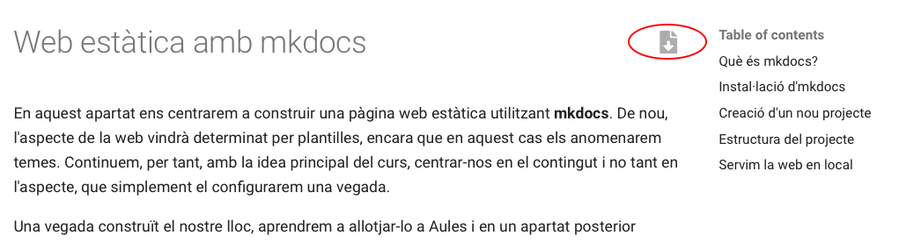

# Configuració

## Modifiquem l'arxiu ***mkdocs.yml***

Tant l'mkdocs com el tema que escolliu tenen moltes possibilitats, però ací veurem la configuració bàsica. Si voleu configurar o personalitzar alguna cosa, haureu de consultar la documentació d'mkdocs o del tema segons el cas.

En este enllaç està la documentació de la configuració d'mkdocs [https://www.mkdocs.org/user-guide/configuration/](https://www.mkdocs.org/user-guide/configuration/).

!!! tip Atenció
    Al final de la unitat posarem de nou una versió completa i comentada d'un arxiu bàsic de configuració

### site_name

L'única configuració que és necessària per a servir la web és el *site_name*, que serà una cadena de text que definirà el títol de la pestanya del navegador i apareixerà en el menú de navegació. Diriem que és el nom que defineix la nostra web, per tant serà la primera configuració que modificarem.

Per exemple, en el cas d'esta web, hem posat com a *site_name: Web estàtica amb mkdocs*

### docs_dir

Amb la directiva site_dir, configurem en quina carpeta tenim els arxius font, és a dir el contingut en format markdown a partir del qual es generarà la web.

!!!note "docs_dir"
    De moment podem deixar sense configurar el docs_dir, però serà necessari en apartats posteriors.

### site_dir

Amb la directiva site_dir, configurem en quina carpeta volem que ens deixe la web llesta per a publicar.

!!!note "site_dir"
    De moment podem deixar sense configurar el site_dir, però serà necessari en apartats posteriors.

## Pàgines

Anem a veure en este apartat com configurar noves pàgines a la nostra web. Seran accessibles a través del menú de navegació.

El primer pas serà incorporar un nou arxiu .md amb contingut, per exemple, about.md a la carpeta docs.

Després modificarem l'arxiu de configuració per afegir al menú de navegació les nostres pàgines de la forma següent:

```yaml
nav:
    - Home: index.md
    - About: about.md
```
Ara la pàgina tindrà l'aspecte següent:


Pots observar que al menú de navegació ara tenim les opcions Home i About i també ens han aparegut unes fletxes de *Previous* i *Next* per poder navegar a través d'elles.

Es poden crear submenús al menú de navegació, configurant el *mkdocs.yml*:

```yaml
nav:
    - Home: index.md
    - Tema 1:
      - Apartat 1: tema1/apartat1.md
      - Apartat 2: tema1/apartat2.md
    - About: about.md
```


## Buscador

Observeu que també disposem d'un buscador al menú de navegació que ens permetrà buscar a través del contingut de la web. 

!!!note "Buscador" 
    Açò pot ser molt útil per als nostres alumnes a l'hora d'utilitzar els nostres recursos com a documentació de referència. Els permetrà localitzar ràpidament el contingut que busuqen.

    Observeu que ens trobarà totes les ocurrències del contingut buscat en tot el lloc web, no sols en la pàgina actual.

## Conversió a pdf

Si es fixeu, podeu trobar un botó a la dreta del títol que ens permet guardar el contingut actual en un pdf:

<center>{width=80%}</center>

Això descarrega un arxiu PDF de la pàgina actual. Aquest PDF es genera en la construcció del lloc, afegint l'afegit que es mostra a continuació:

```yaml
plugins:
  - pdf-export  # plugin per exportar a pdf
```

!!! info Consideracions

    - Es recomana posar aquest plugin quan ho tingues tot composat, sinò en cada guardat que es fa mentre està el servei en marxa es generen tots els PDF, el que pot suposar una compilació lenta.
    - El PDF generat, conte el contingut `ad-hoc`, sense cap mena de paginació ni resultat tan professional com l'obtingut a la unitat de PDF

## Tema

Fins ara, hem utilitzat el tema per defecte per a renderitzar la pàgina, però existeixen altres temes per canviar l'aspecte a la nostra web, sense haver de canviar res al nostre contingut.

Per canviar el tema, editem l'arxiu de configuració i afegim una línia com la següent:

```yaml
theme: readthedocs
```
En guardar l'arxiu, l'aspecte haurà canviat:

Tema readthedocs


Tema mkdocs


Tema material


!!!note "Temes per defecte"
    Mkdocs sols incorpora dos temes, mkdocs i readthedocs, però hi ha temes desenvolupats per tercers que podeu utilitzar. Simplement s'hauria de mirar a la documentació corresponent com posar-los en funcionament. Sol ser un procés molt senzill. 

    Al següent enllaç tens informació sobre altres temes per a mkdocs, [https://github.com/mkdocs/mkdocs/wiki/MkDocs-Themes](https://github.com/mkdocs/mkdocs/wiki/MkDocs-Themes).

!!!note "Material for mkdocs"
    Un tema molt complet, amigable i versàtil és material for mkdocs. Consulteu la documentació en cas de voler-lo utilitzar. 
    
    Per instal·lar-lo executeu `pip install mkdocs-material`.

    Per utilitzar-lo `theme: material`.

    [https://squidfunk.github.io/mkdocs-material/](https://squidfunk.github.io/mkdocs-material/)

## Canviant l'icona de la nostra web

Per defecte, mkdocs utilitza la seua propia icona. Si volem utilitzar una icona diferent, crea un directori `img` a la carpeta `docs` i guarda una icona amb el nom `favicon.ico`, mkdocs el detectarà i el canviarà automàticament.

## Afegint *admonitions* (caixes de l'estil awesomebox)

Per poder fer ús de les caixes per resaltar contingut, hem d'afegir el plugin admonition a l'arxiu de configuració:

```yaml
markdown_extensions:
  - admonition
```

A diferència d'awesomebox, les caixes a mkdocs es defineixen amb tres tancaments d'exclamació, i el contingut de dins la caixa va tabulat. Per exemple:

```markdown
!!!note "Anotació"
    Esta part si que la podeu provar a casa.

!!!warning "Compte!"
    Aneu amb compte al realitzar esta part.

!!!danger "Perill!!"
    No proveu açò a casa.
```

!!!note "Anotació"
    Esta part si que la podeu provar a casa.

!!!warning "Compte!"
    Aneu amb compte al realitzar esta part.

!!!danger "Perill!!"
    No proveu açò a casa.

### `admonitions` tancades

Si volem colapsar i obrir caixes d'admonitions, podem conseguir l'efecte canviat les tres exclamacions (`!!!`) per tres interrogants (`???`). Tambe podem fer que la caixa estigui oberta inicialment afegint un símbols `+`.

Per poder aconseguir-ho, hem d'activar aquest plugins, posant al `mkdocs.yml` el seguent:

```yml
markdown_extensions:
  - admonition
  - attr_list
  - pymdownx.details
  - pymdownx.superfences
```

Així si escrivim el següent codi,

```
??? note "Caixa tancada que podem obrir"
    Aquesta caixa puc obrir-la i tancar-la

???+ example "Caixa oberta que podem tancar"
    Aquesta caixa puc tancar-la i obrir-la
```

El resultat seran aquestes vistoses capses.

??? note "Caixa tancada que podem obrir"
    Aquesta caixa puc obrir-la i tancar-la

???+ example "Caixa oberta que podem tancar"
    Aquesta caixa puc tancar-la i obrir-la

## Copiant codi font

Com be acabem de veure, dalt teniem una capsa amb codi font en format yaml. Quan blocs de codi pot resultar molt interessant el disposar d'un mecanisme per a copiar dit codi i porta-lo allà on vulguem (consola, un IDE, etc.)

Per activar aquest boto de copia i altres coses, podem afegir al `mkdocs.yml` el següents comportaments, dins de l'opció del tema:

```yml
theme:
  name: material
  ...               # altres configuracions     
  features:
    - content.code.copy
    - content.code.select
    - content.code.annotate
```

Podem combinar-ho amb el plugin `pymdownx` d'abans per a numerar les línies, tot i això evitant el copiarles amb el botó anterior (clàssic problema al copiar i apegar codi des de arxius PDF)

Combinant el vist aanteriorment podem combinar-ho per a aconseguir coses com la següent:

```
??? question "Quina és la estructura d'un programa Python?"

    ```python
        import os
        def main():
            # Ací el teu codi en python
            print("Hol, mon!")

        if __name__ == "__main__":
            main()
    ```
    
    Copia i prova el teu codi a un IDE
```

donant com a resultat:

??? question "Quina és la estructura d'un programa Python?"

    ```python
        import os
        def main():
            # Ací el teu codi en python
            print("Hol, mon!")

        if __name__ == "__main__":
            main()
    ```
    
    Copia i prova el teu codi a un IDE

## Construim el lloc web

Finalment, després d'haver comprovat al nostre ordinador que el resultat és l'esperat, construïm el lloc web, és a dir, el deixem enllestit per poder-lo penjar a un servidor amb l'ordre:

```sh
mkdocs build
```

Veuràs que es crea una carpeta *site* amb l'estructura següent:

<!---->

<center>{width=50%}</center>

Esta carpeta conté tots els arxius necessaris per servir la web, i és la carpeta que publiquen els servidors per a accedir a les seues respectives webs.

## Resum

1. Instal·lem mkdocs.
2. Creem un nou projecte amb `mkdocs new "nom del projecte"`.
3. Servim el lloc en local i comprovem que tot va funcionant i es visualitza com desitgem amb `mkdocs serve`.
4. Afegim el contingut en arxius .md a la carpeta docs.
5. Enllacem els diferents arxius al menú de navegació modificant l'arxiu mkdocs.yml.
6. Configurem el tema, el nom del lloc i la resta de configuracions que vulguem utilitzar.
7. Construim el lloc amb `mkdocs build`.

## Arxiu `mkdocs.yml` base

```yaml
# Nom del lloc
site_name: Web estàtica amb mkdocs

# Carpeta amb el documents fot
docs_dir: 'md'

# Carpeta on es generarà el lloc web (mkdocs build)
site_dir: 'docs'

# Adreça on s'executa el server local (mkdocs serve)
dev_addr: localhost:4000

# Navegació dels documents
# nav:
#   - Títol: Document.md
nav:
  - Introducció i  intal·lació: introduccio.md
  - Configuració: configuracio.md
  - Allotgem la web a Aules: aules.md
  - Allotgem la web a github: github.md
  - "Docència: Aules o github?": aules vs github.md

# Extenions
markdown_extensions:
  - admonition
  - attr_list         # permet afegir atributs a les etiquetes html 
  # pymdownx és una col·leccio per escritura tècnica. S'instal·la per defecte
  - pymdownx.details
  - pymdownx.superfences
  - pymdownx.highlight:
      linenums: true
      anchor_linenums: true
      auto_title: true

# Tema a triar
theme: 
  name: material  # selecció del tema
  palette:
   # Boto que canvia a mode oscur
    - scheme: default
      toggle:
        icon: material/brightness-7 
        name: Switch to dark mode
    # Botó que canvia a mode clar
    - scheme: slate
      toggle:
        icon: material/brightness-4
        name: Switch to light mode
  features:
    # utilitats de copia de codi
    - content.code.copy 
    - content.code.select
    - content.code.annotate
    - navigation.footer       # footer de la pagina, amb navegació
    - navigation.top    # boto flotant de tornar a dalt 

# Altres afegits
plugins:
  - search      # plugin del quadre cerca
  - pdf-export  # plugin per exportar a pdf
```